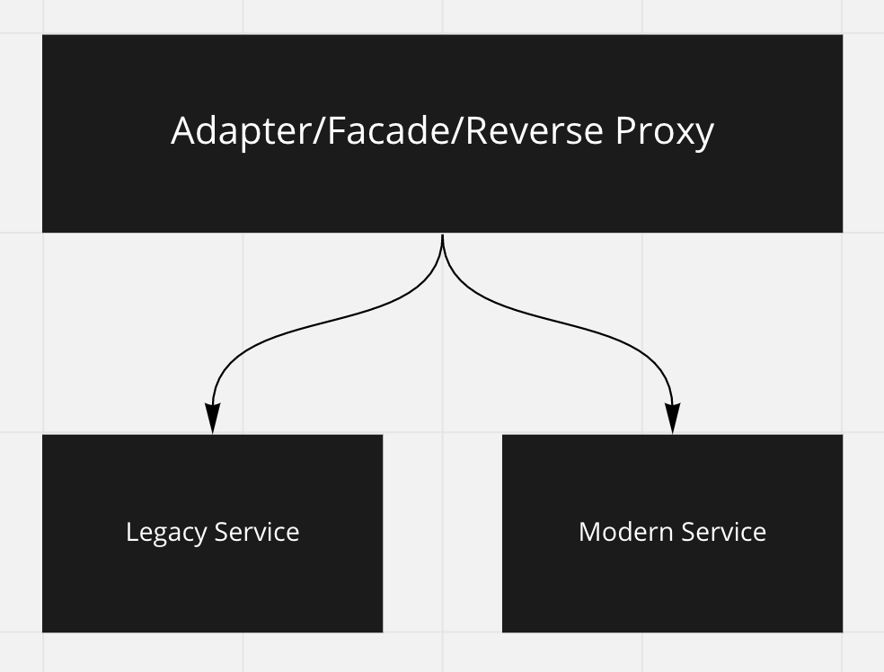

# Strangler
The **Strangler** is used to gradually move from one service implementation to another.  This is typically used to move a legacy service to something more modern.  **Facade** or **Adapter** patterns and/or a **Reverse Proxy** is typically used to send requests to one server or the other.

## On the UI
A similar strategy can be used to move from a legacy UI library to something more modern.  A facade/adapter/interop of some kind  can be used to mediate the two libraries.

