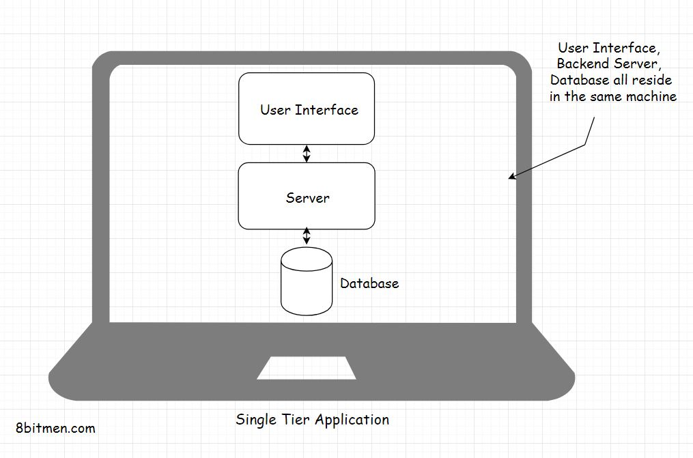
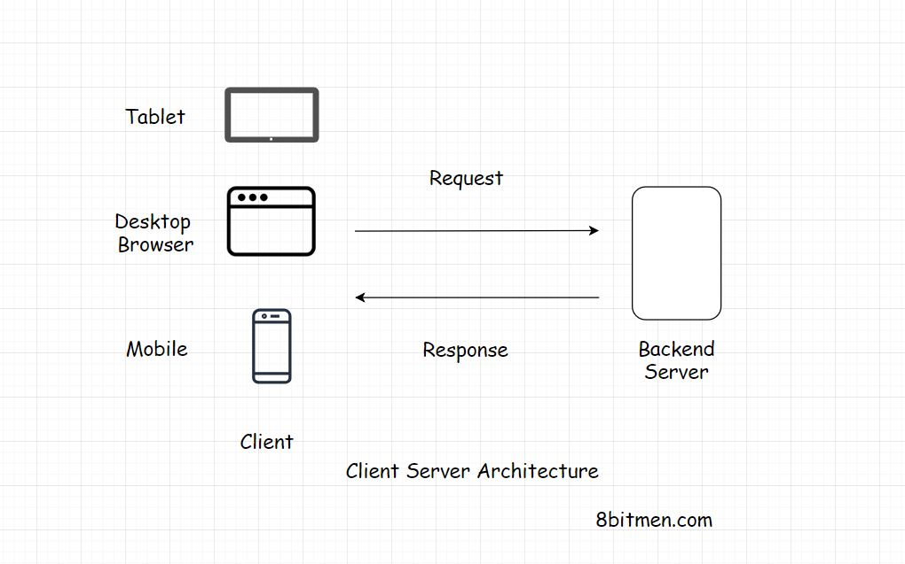

## Intro:

Importance of getting the application architecture right
- base needs to be carefully considered in order to avoid major design changes or refactors later

### Process
- Requirement gathering & analysis
    - the study and discussion of business requirements
- High level design
    - brainstorming usecase implementation
- Technology research
- PoC
    - helps get a closer, hands-on view on the tech and basic use case impl
        - pros and cons of tech, perf, and other limitations
    - helps with the learning curve of the tech
    - non-technical contributors have something concrete to play with
    - stakeholders get an idea of the implementation

## Tiers of software architecture:

What is a tier?
A logical separation of components in an app/service. Physical separation at the component level, not code.

### What is a component?
- Database
- Backend application server
- User interface
- Messaging
- Caching

### Single tier applications
A single-tier application is an application where the user interface, backend business logic & the database all reside in the same machine.

#### What are some tier 1 apps?
- MS Office
- PC Games
- Photo editing software

#### Advantages
- No network latency because there's no network to deal with since all components are on one machine
- No data requests to the server -- data is quick and easily available since it's all one a single machine

#### Disadvantages
- No control over the application in terms of updates or feature changes
- Can be tweaked/reverse engineered
- Depends on the system capabilities

### Two Tier Applications
A Two-tier application involves a client and a server. The client would contain the user interface & the business logic in one machine. And the backend server would be the database running on a different machine. The database server is hosted by the business & has control over it.

#### What are some tier 2 apps?
- Todo list
- Planner
- Productivity app

#### Advantages
- Fewer network calls to BE because most code and all of the UI reside on the user's device
- Single app download with occasional updates available
- less money on servers

#### Disadvantages
- Architectural severely limits app scope
- Code still could be reverse engineered

### Three Tier Applications
In a three-tier application, the user interface, application logic & the database all lie on different machines & thus have different tiers. They are physically separated.

#### What are some tier 3 apps?
- Blog
- News website

#### Advantages
- Scope is less limited given the distribution across multiple components
- Decoupling prevents spaghetti across high-level layers

#### Disadvantages
- More infrastructure to manage