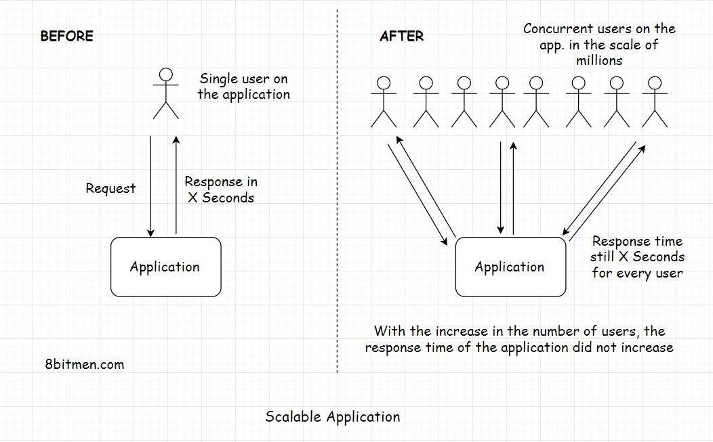

# Scalability
## What is Scalability?
> Scalability means the ability of the application to handle & withstand increased workload without sacrificing the latency.

- a scalable app will always take the same amount of time to respond to a single request as it does to millions of concurrent requests
- the backend infrastructure should not crumble under the load
- it should handle heavy traffic easily and maintain the latency

### What is Latency?
- amount of time a system takes to respond to a request
    - a request takes 2 seconds to return a response, the latency of the system is 2 seconds
- strive for minimum latency
    - no matter hwo much the traffic load on a system builds, the latency should not increase
- When thought of in terms of Big-O, ideally our scalability would be O(1)
    - O(n^2) would not be scalable

### Measuring Latency
- time difference between user action and system response
- categorized as:
    - network latency
    - application latency

### Network Latency
- time it takes for a data packet to travel from A to B
- some strategies employed for resolving latency issues involve CDNs and distributing servers across the globe

### Application Latency
- time an application takes to process a user request
- run stress & load tests & scan for bottlenecks that slow down the system
