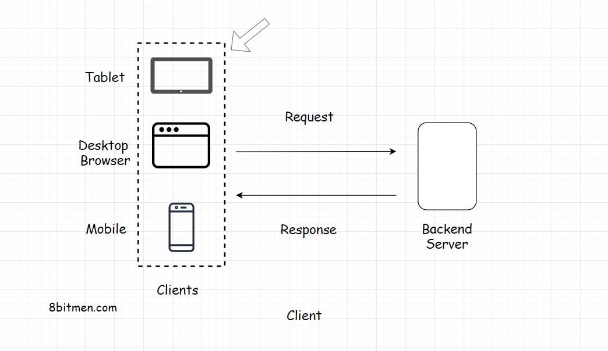
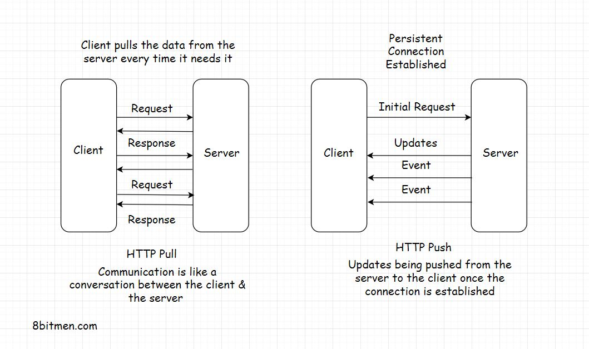

# Web Architecture
An online service formed by multiple components running in conjunction with each other.  Some components would be:
- Database
- Message queue
- Cache
- UI
- ...

## Client-Server Architecture
The fundamental building block of the web.
- Request/response model
    - Client sends request to the server which gives a response
- Every website is built on client-server architecture
- Some, very few, business sites are peer-to-peer, which is different

## The Client
- User interface
    - mobile app
    - web client
    - command-line app
    - API
    - desktop application

## Types of Clients
- Thin Client
    - No business logic
    - Only presentation
- Thick Client
    - aka Fat Client
    - aka Heavy Client
        - contains business logic

## Server
> The primary task of a web server is to receive the requests from the client & provide the response after executing the business logic based on the request parameters received from the client.

Non-application servers
- Proxy
- Mail
- File
- Virtual

Config & type can differ depending on the case
- Backend in Java may suggest Apache Tomcat or Jetty
- Simple sites may suggest an Apache HTTP server

## Communication Between Client and Server
- request-response model
- HTTP
    - stateless
        - all requests know nothing about previous requests and are executed independently
        - https://developer.mozilla.org/en-US/docs/Web/HTTP/Overview

### REST and API Endpoints
- Clients need to hit a REST endpoint to fetch data from a backend
- The backend has a REST API implemented, which is the interface to the outside world
- Every request, internal and external, has to hit the endpoints to fetch data

## What is REST?
> REST stands for Representational State Transfer. It’s a software architectural style for implementing web services. Web services implemented using the REST architectural style are known as the RESTful Web services.

- Adheres to the REST architectural constraints
- is an interface
- uses HTTP
- servers can cache response, improving the performance of the application
- communication between client and server is stateless

### Decoupling Clients & the Backend
Given the exposed endpoints, the backend does not need to worry about the client implementation.  That said, a clear separation can be difficult depending on the system design.  An example of a pure and completely separate service would be one that handles the product-defined use cases for data handling, and exposes those

### Application Development Before REST
- Service/Client were tightly coupled
    - JSP (Java Server Pages)
        - tags contained business logic
        - refactoring became difficult because business logic was spread across layers
        - separate code/classes for handling reqs from different clients

### API Gateway

- Layer that acts as a gateway into the system
- encapsulates business logic
- handles all client requests, regardless of client type
- handles auth/auth
- sanitizing data

## HTTP Push & Pull – Introduction
There're two modes of transfer between the client and server -- HTTP PUSH and HTTP PULL

### HTTP PULL
- Every response is the result of a request
- This request-response communication is called HTTP PULL
- Client "pulls" data from the server when it needs to
- Each req/res consumes bandwidth, costs money, and adds load

### HTTP PUSH
- Client requests data once
- Server continues to push updates to the client when they're available
- Saves lots of network bandwidth and server load
- Common example is notifications
- Tech involved in HTTP Push:
    - Ajax Long polling
    - Web Sockets
    - HTML5 Event Source
    - Message Queues
    - Streaming over HTTP

## HTTP Pull – Polling with AJAX
Data can be fetched in several ways:
- HTTP GET request to the server manually by trigger an event, like a `'click'`
- Fetching dynamically at regular intervals using AJAX without human intervention

### AJAX - Asynchronous JavaScript & XML
> AJAX stands for asynchronous JavaScript & XML. The name says it all, it is used for adding asynchronous behaviour to the web page

- AJAX enables us to fetch the updated data from the server by automatically sending requests over and over at stipulated intervals
- Once updates are complete, the client-side app can update with the completed data
    - common on sports and news sites where new information is dynamically displayed without reloading
- AJAX uses an XMLHttpRequest object for sending requests

## HTTP Push
### Time to Live (TTL)
If a request doesn't receive a response within x time (dependent on browser), the connection times out, and the client must re-send the request.

Open connections consume resources, and there's a limit to the amount of open connections a server can have at any one point. If the connection doesn't close and new ones are being opened, the server will eventually run out of memory.  This is why the TTL exists.

### Persistent Connections
> A persistent connection is a network connection between the client & the server that remains open for further requests & the responses, as opposed to being closed after a single communication.

HTTP push-based communication between the client and server.

### Heartbeat Interceptors
> Now you might be wondering how is a persistent connection possible if the browser kills the open connections to the server every X seconds?

Heartbeat interceptors are blank req/res between the client and server used to prevent the browser from killing the connection.

- can be resource intensive
- sometimes vital to realizing a feature
    - online multiplayer game
        - so many quick actions mean that the heartbeats are rarely needed
- long open connections can be implemented using long polling, web sockets, and server-sent events

https://www.pubnub.com/blog/websockets-and-long-polling-in-javascript-ruby-and-python/

## HTTP Push-based Technologies
### Web Sockets
- used for persistent bi-directional low-latency data flow between client to the server and back
- chat apps, social streams, browser-based MMOs -- all which have far more read/write than a regular web app
- client/server connection can be open as long as is necessary
- TCP based instead of HTTP based

https://developer.mozilla.org/en-US/docs/Web/API/WebSockets_API
https://www.html5rocks.com/en/tutorials/websockets/basics/

### Long Polling
- Server holds the response until it finds an update to send to the client
- connection stays open a bit longer when compared to regular polling
- server doesn't return an empty response
- if the connection breaks, the client needs to reestablish it
- fewer requests since the connection is left open longer, reducing bandwidth consumption
- good for simple async data fetches

### HTML5 Event Source API and Server-Sent Events
https://developer.mozilla.org/en-US/docs/Web/API/Server-sent_events/Using_server-sent_events

- Server automatically pushes the data to the client whenever updates are available
- Incoming server messages are treated as Events
- Client establishes an initial request and the server perpetuates it with updates
- `EventSource` HTML5 API is used
- Twitter, stock feeds, and real time notifications are examples of this tech in use

### Streaming of HTTP
- Ideal for large data being streamed over HTTP by breaking into smaller chunks
- HTML5 & JavaScript Stream API

